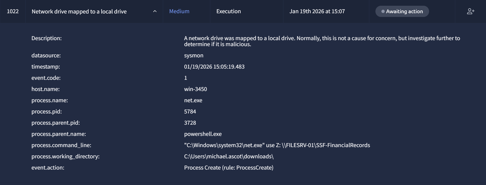
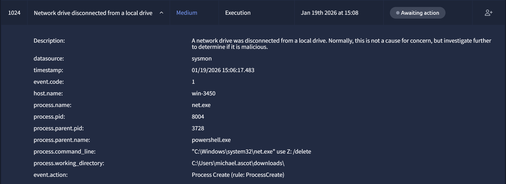
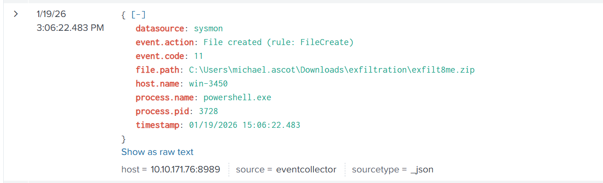
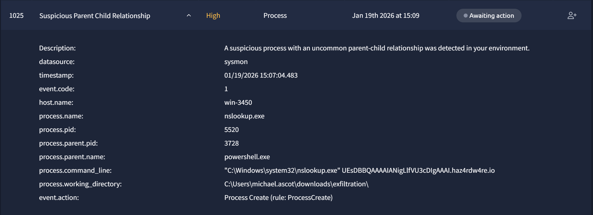
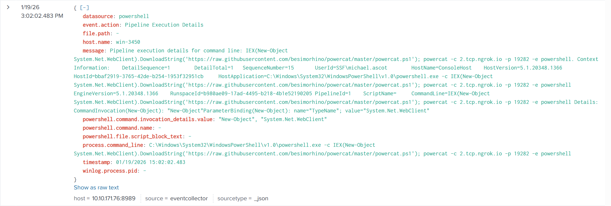

# Simulator SOC - Phishing Unfolding

This report documents the investigation of multiple alerts from a SOC Simulator of TryHackMe.  
While most alerts were classified as low severity spam or false positives, a detailed analysis revealed a phishing campaign that led to endpoint compromise, post-exploitation activity, and data exfiltration attempts.

The objective of this report is to document the analyst’s investigation process, evidence correlation, and incident response decisions.

### Triage Log – Phishing

This document summarizes all low severity phishing-related alerts observed during the SOC Simulator run.

| Time (UTC) | Alert ID | Alert Type | Sender | Recipient | Subject | Verdict | Severity | Notes |
|-----------|--------|-----------|--------|---------|--------|--------|--------|-------|
| 14:31:46 | 1000 | Suspicious email | eileen@trendymillineryco.me | support@tryhatme.com | Inheritance Alert: Unknown Billionaire Relative Left You Their Hat Fortunes | True Positive (Spam) | Low | Classic inheritance scam, social engineering |
| 14:36:52 | 1011 | Suspicious email | keane@modernmillinerygroup.online | michael.ascot@tryhatme.com | Amazing Hat Enhancement Pills Grow Your Hat Collection Instantly | True Positive (Spam) | Low | Unrealistic marketing, suspicious TLD |
| 14:39:49 | 1017 | Suspicious email | osman@fashionindustrytrends.xyz | kyra.flores@tryhatme.com | Time Traveling Hat Adventure Explore Ancient Lands for Cheap | True Positive (Spam) | Low | Unusual domain, marketing scam |
| 14:52:48 | 1013 | Suspicious email | griffin@hatventuresworldwide.online | armaan.terry@tryhatme.com | Work from Home and Make 10000 a Day Scam Alert | True Positive (Spam) | Low | Work-from-home scam pattern |
| 14:59:49 | 1014 | Suspicious email | odom@gmail.com | liam.espinoza@tryhatme.com | Exclusive Offer: Buy 100 Hats Get 99 Free Limited Time Only | True Positive (Spam) | Low | Free offer scam |
| 15:00:32 | 1017 | Suspicious email | stone@fashionindustrytrends.xyz | armaan.terry@tryhatme.com | Time Traveling Hat Adventure Explore Ancient Lands for Cheap | True Positive (Spam) | Low | Marketing spam, suspicious sender domain |
| 15:01:04 | 1018 | Suspicious email | comb@hatventuresworldwide.online | liam.espinoza@tryhatme.com | Win a Trip to Hat Disneyland Magical Memories Await | True Positive (Spam | Low | Marketing spam | 

### Summary

- All alerts were classified as **True Positive – Spam / Phishing**  
- No user interaction or compromise observed for these alerts  
- Detection rule requires tuning to reduce noise from marketing spam

### Recommended Actions

- Block sender domains at the email gateway  
- Tune phishing detection rules to reduce false positives  
- Provide user awareness reminder

---

With this SOC simulator run, there was also some legetimate process. This document sumurizes all false positive alerts due to process.

### Triage Log - Normal process

| Time (UTC) | Alert ID | Host | Parent Process | Child Process | Command Line | Verdict | Severity | Notes |
|-----------|----------|------|----------------|---------------|--------------|---------|----------|-------|
| 14:34:10 | 1001 | win-3459 | services.exe | TrustedInstaller.exe | C:\Windows\servicing\TrustedInstaller.exe | False Positive | Low | Legitimate Windows servicing activity |
| 14:36:34 | 1002 | win-3451 | svchost.exe | taskhostw.exe | taskhostw.exe KEYROAMING | False Positive | Low | Normal Windows user profile operation |
| 14:43:06 | 1006 | win-3450 | svchost.exe | rdpclip.exe | rdpclip | False Positive | Low | RDP clipboard service |
| 14:43:56 | 1007 | win-3451 | svchost.exe | taskhostw.exe | taskhostw.exe KEYROAMING | False Positive | Low | Normal Windows user profile operation |
| 14:45:48 | 1008 | win-3455 | services.exe | WUDFHost.exe | WUDFHost.exe -HostGUID {...} | False Positive | Low | Windows User-Mode Driver Framework |
| 14:46:36 | 1009 | win-3453 | svchost.exe | rdpclip.exe | rdpclip | False Positive | Low | Legitimate RDP clipboard process |
| 14:49:52 | 1010 | win-3455 | services.exe | WUDFHost.exe | WUDFHost.exe -HostGUID {...} | False Positive | Low | Hardware driver interaction |
| 14:55:25 | 1012 | win-3459 | services.exe | svchost.exe | svchost.exe -k wsappx -p | False Positive | Low | Windows Store / AppX service |
| 15:00:23 | 1015 | win-3449 | services.exe | TrustedInstaller.exe | C:\Windows\servicing\TrustedInstaller.exe | False Positive | Low | Windows update / component servicing |
| 15:00:23 | 1016 | win-3456 | svchost.exe | taskhostw.exe | taskhostw.exe NGCKEYPreGen | False Positive | Low | Windows Hello key generation |
| 15:01:25 | 1019 | win-3460 | svchost.exe | taskhostw.exe | taskhostw.exe KEYROAMING | False Positive | Low | Normal Windows user profile operation |
| 15:04:35 | 1021 | win-3451 | svchost.exe | taskhostw.exe | taskhostw.exe KEYROAMING | False Positive | Low | Normal Windows user profile operation |

### Summary

- All alert were classified as **False Positive**
- No user interaction or compromise observed for these alerts
- Detection rule requires tuning to reduce noise from legetimate process

### Recommended Actions 

- Tune legetimate process detection rules to reduce false positives

_____________________________________________________________________________________________________________________________________________________________________________________________

### Suspicious alert

Among these alerts with low severity, there was one very suspicious

An investigation with splunk is necessary. The first is to find this alert on splunk

Then because of the time and what wause this activation, we can determine what cause this activation of powershell

The origin of the compromision is a spam with some malware as an attachment who have been open and downloaded. 
The alert of the activation of powershell was reported and escalted before the spam, due to the urgency.

---

#### Time of activity: 

Jan 19th 2026 at 15:05

#### List of Affected Entities: 

- Host: win-3450
- User: michael.ascot
- Process: powershell.exe
- Script: PowerView.ps1

#### Reason for classifying as True Positive : 

The launch of the "powershell.exe" process from the Downloads directory is abnormal. After investigation it originated from a phishing email sent to the compromised user.

#### Reason for escalating the Alert : 

The malware can lunch powershell.exe on the ceo's computer so it can access important files.

#### Recommended Remediation Actions :

- Immediately isolate the affected host (win-3450) from the network  
- Terminate the malicious PowerShell process  
- Remove the malicious script `PowerView.ps1` from the system  
- Reset credentials for the affected user  
- Block the sender domain and attachment hash at the email gateway  
- Conduct a full endpoint scan to identify additional malicious artifacts  
- Review logs for lateral movement or further post-exploitation activity

#### - List of Attack Indicators :

- Phishing email with malicious attachment `ImportantInvoice-Febrary.zip`
- Execution of a disguised shortcut file `invioce.pdf.lnk`
- Creation of PowerShell script `__PSScriptPolicyTest_tuwnh53e.jfw.ps1`
- Creation and execution of `PowerView.ps1`
- Abnormal execution of `powershell.exe` from the Downloads directory
- PowerShell used for post-exploitation reconnaissance

---

After that, 3 more medium alerts were popping. if we analyze them it's all preparation for the exfiltration.

#### Network Share mapping

"net.exe use Z: \FILESERV-01\SSF-FinancialRecords" The attacker mapped a network drive (Z:) with net.exe. 

It can access distant files like they were local. 

#### Staging 

"robocopy.exe Z:\ C:\Users\michael.ascot\downloads\exfiltration /E" 

After searching, robocopy is a command-line directory replication tool. The sensitive files are copied from the server, then they are stored for exfiltration 

#### Cleanup 

"net.exe use Z: /delete" 

The network drive is deleted to reduce traces.

#### Archive Creation

File created
"C:\Users\michael.ascot\Downloads\exfiltration\exfilt8me.zip"

The final staging is the creation of the archive exfilt8me.zip inside the directory. It contains the collected files.

---

Finally, 10 alerts like this appeared. This is the phase of exfiltration.

We can observe :

- process.name: nslookup.exe
- parent: powershell.exe
- Sub-domain encoded
- Domain unknown (haz4rdw4re.io)

That's not normal behavior and it come from the same compromised user.

--> Nslookup is used to perform DNS queries with little chunk of encoded data. And it's sent to an external server controlled by the attacker (haz4rdw4re.io).

After another investigation we discover that a PowerShell command downloaded and executed powercat.ps1.

So we can conclude to a reverse shell connection to an external host, allowing remote command execution.
This behavior is consistent with a temporary backdoor providing remote access to the attacker.

---

This investigation confirms a successful phishing attack leading to the execution of malicious PowerShell scripts, network share access, staged data collection, DNS-based exfiltration, and the establishment of a temporary reverse shell.
The incident demonstrates how low severity alerts can escalate into a full compromise when correlated across email and endpoint.

This case highlights the importance of alert triage, timeline correlation, and early escalation to prevent data loss.
