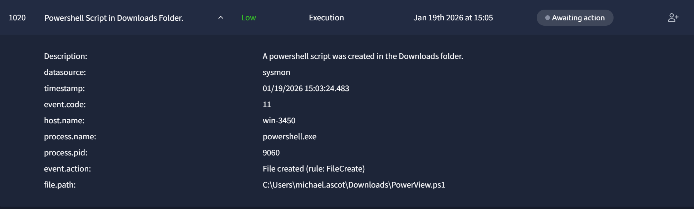
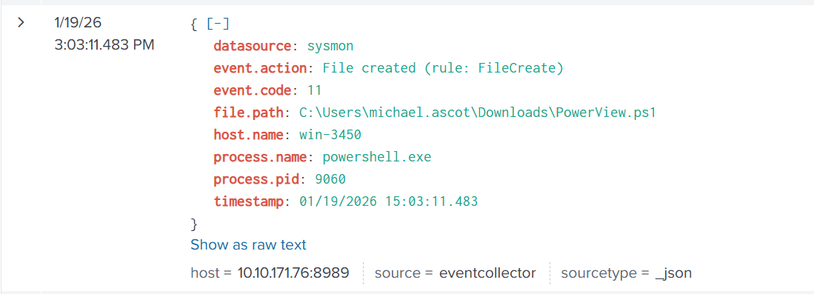
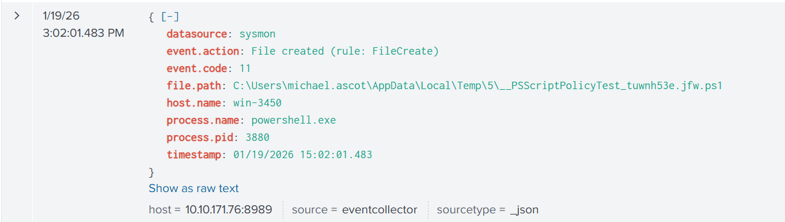
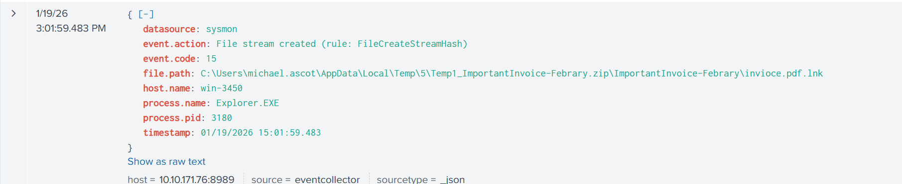
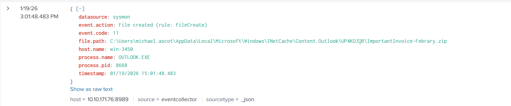
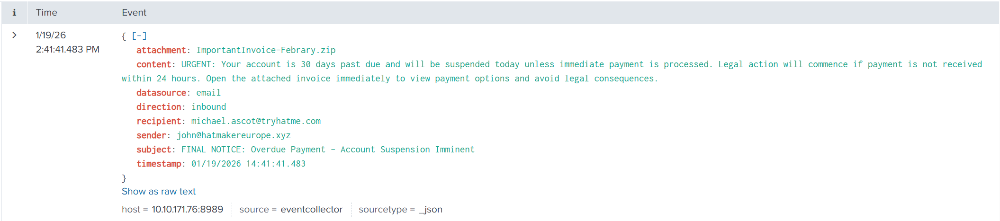

# Triage Log – Phishing Unfolding

This document summarizes all low severity phishing-related alerts observed during the SOC Simulator run.

| Time (UTC) | Alert ID | Alert Type | Sender | Recipient | Subject | Verdict | Severity | Notes |
|-----------|--------|-----------|--------|---------|--------|--------|--------|-------|
| 14:31:46 | 1000 | Suspicious email | eileen@trendymillineryco.me | support@tryhatme.com | Inheritance Alert: Unknown Billionaire Relative Left You Their Hat Fortunes | True Positive (Spam) | Low | Classic inheritance scam, social engineering |
| 14:36:52 | 1011 | Suspicious email | keane@modernmillinerygroup.online | michael.ascot@tryhatme.com | Amazing Hat Enhancement Pills Grow Your Hat Collection Instantly | True Positive (Spam) | Low | Unrealistic marketing, suspicious TLD |
| 14:39:49 | 1017 | Suspicious email | osman@fashionindustrytrends.xyz | kyra.flores@tryhatme.com | Time Traveling Hat Adventure Explore Ancient Lands for Cheap | True Positive (Spam) | Low | Unusual domain, marketing scam |
| 14:52:48 | 1013 | Suspicious email | griffin@hatventuresworldwide.online | armaan.terry@tryhatme.com | Work from Home and Make 10000 a Day Scam Alert | True Positive (Spam) | Low | Work-from-home scam pattern |
| 14:59:49 | 1014 | Suspicious email | odom@gmail.com | liam.espinoza@tryhatme.com | Exclusive Offer: Buy 100 Hats Get 99 Free Limited Time Only | True Positive (Spam) | Low | Free offer scam |
| 15:00:32 | 1017 | Suspicious email | stone@fashionindustrytrends.xyz | armaan.terry@tryhatme.com | Time Traveling Hat Adventure Explore Ancient Lands for Cheap | True Positive (Spam) | Low | Marketing spam, suspicious sender domain |
| 15:01:04 | 1018 | Suspicious email | comb@hatventuresworldwide.online | liam.espinoza@tryhatme.com | Win a Trip to Hat Disneyland Magical Memories Await | True Positive (Spam | Low | Marketing spam | 

## Summary

- All alerts were classified as **True Positive – Spam / Phishing**  
- No user interaction or compromise observed for these alerts  
- Detection rule requires tuning to reduce noise from marketing spam

## Recommended Actions

- Block sender domains at the email gateway  
- Tune phishing detection rules to reduce false positives  
- Provide user awareness reminder

With this SOC simulator run, there was also some legetimate process. This document sumurizes all false positive alerts due to process.

| Time (UTC) | Alert ID | Host | Parent Process | Child Process | Command Line | Verdict | Severity | Notes |
|-----------|----------|------|----------------|---------------|--------------|---------|----------|-------|
| 14:34:10 | 1001 | win-3459 | services.exe | TrustedInstaller.exe | C:\Windows\servicing\TrustedInstaller.exe | False Positive | Low | Legitimate Windows servicing activity |
| 14:36:34 | 1002 | win-3451 | svchost.exe | taskhostw.exe | taskhostw.exe KEYROAMING | False Positive | Low | Normal Windows user profile operation |
| 14:43:06 | 1006 | win-3450 | svchost.exe | rdpclip.exe | rdpclip | False Positive | Low | RDP clipboard service |
| 14:43:56 | 1007 | win-3451 | svchost.exe | taskhostw.exe | taskhostw.exe KEYROAMING | False Positive | Low | Normal Windows user profile operation |
| 14:45:48 | 1008 | win-3455 | services.exe | WUDFHost.exe | WUDFHost.exe -HostGUID {...} | False Positive | Low | Windows User-Mode Driver Framework |
| 14:46:36 | 1009 | win-3453 | svchost.exe | rdpclip.exe | rdpclip | False Positive | Low | Legitimate RDP clipboard process |
| 14:49:52 | 1010 | win-3455 | services.exe | WUDFHost.exe | WUDFHost.exe -HostGUID {...} | False Positive | Low | Hardware driver interaction |
| 14:55:25 | 1012 | win-3459 | services.exe | svchost.exe | svchost.exe -k wsappx -p | False Positive | Low | Windows Store / AppX service |
| 15:00:23 | 1015 | win-3449 | services.exe | TrustedInstaller.exe | C:\Windows\servicing\TrustedInstaller.exe | False Positive | Low | Windows update / component servicing |
| 15:00:23 | 1016 | win-3456 | svchost.exe | taskhostw.exe | taskhostw.exe NGCKEYPreGen | False Positive | Low | Windows Hello key generation |
| 15:01:25 | 1019 | win-3460 | svchost.exe | taskhostw.exe | taskhostw.exe KEYROAMING | False Positive | Low | Normal Windows user profile operation |
| 15:04:35 | 1021 | win-3451 | svchost.exe | taskhostw.exe | taskhostw.exe KEYROAMING | False Positive | Low | Normal Windows user profile operation |

## Summary

- All alert were classified as **False Positive**
- No user interaction or compromise observed for these alerts
- Detection rule requires tuning to reduce noise from legetimate process

## Recommended Actions 

- Tune legetimate process detection rules to reduce false positives

_____________________________________________________________________________________________________________________________________________________________________________________________

Among these alerts with low severity, there was one very suspicious

An investigation with splunk is necessary. The first is to find this alert on splunk

Then because of the time and what wause this activation, we can determine what cause this activation of powershell

The origin of the compromision is a spam with some malware as an attachment who have been open and downloaded. 
Before escalated the spam we have to report the alert of the activation of powershell.

Time of activity: Jan 19th 2026 at 15:05

List of Affected Entities: win-3450
